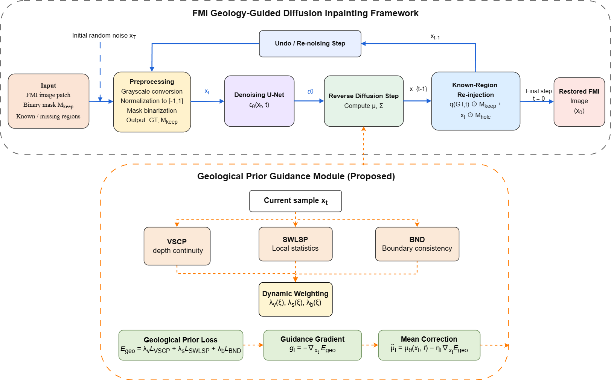
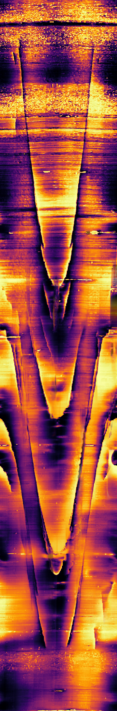

# Geoscience Topological Diffusion (GeoTopoDiff)

GeoTopoDiff is a geology-guided diffusion framework for restoring stripe-shaped missing regions in fullbore formation microimager (FMI) images. The method introduces stratigraphic bedding and borehole-circumferential topological constraints into the reverse diffusion process to improve structural continuity and boundary consistency in restored regions.

This repository accompanies the manuscript:

**A Diffusion Model Based on Stratigraphic Bedding and Borehole-Circumferential Topological Constraints**

<p align="center">
  
</p>

## Authors

**First author:** Xiubin Ma

**Corresponding author:** Bo Shen
**Email:** [shhd151@126.com](mailto:shhd151@126.com)
**Telephone:** +86-27-6911-1036

## Affiliation

School of Geophysics and Petroleum Resources, Yangtze University, Wuhan, China

## Repository

https://github.com/xiutongxue/Geoscience-Topological-Diffusion-GeoTopoDiff-

## Main Features

* Restoration of stripe-shaped missing regions in FMI images
* Support for grayscale and color images
* Geology-guided reverse diffusion without retraining the diffusion backbone
* Stratigraphic bedding continuity constraints
* Borehole-circumferential topological constraints
* Evaluation using no-reference image quality metrics

## Repository Structure

```text
GeoTopoDiff/
├── confs/
│   └── FMI_Image.yml
├── data/
│   └── datasets/
│       ├── gts/
│       │   └── fmi/
│       └── gt_keep_masks/
│           └── fmi/
├── img_folder/
│   ├── framework.jpg
│   └── example.jpg
├── log/
├── outputs/
├── test_stable_v3c_bypass_repaint_statmask.py
├── Evaluation_integrated.py
├── requirements.txt
└── README.md
```

## Data Preparation

### FMI images

Input images must satisfy the following requirements:

* Image size: `256 × 256` pixels
* Image type: grayscale or color FMI image
* File format: `.png` or `.jpg`

Place the FMI image patches in:

```text
data/datasets/gts/fmi/
```

Example filenames:

<p align="center">
  
</p>

Large FMI logging images should first be cropped into non-overlapping or predefined `256 × 256` patches.

### Keep masks

Each FMI image requires a corresponding binary keep mask with the same spatial dimensions.

Mask convention:

* `255`: known or observed region
* `0`: missing region to be restored

Place the masks in:

```text
data/datasets/gt_keep_masks/fmi/
```

Each image and its corresponding mask should follow the filename-matching rule implemented by the data loader.

Example:

```text
data/datasets/gts/fmi/FMI_001.png
data/datasets/gt_keep_masks/fmi/FMI_001.png
```

## Configuration

The main configuration file is:

```text
confs/FMI_Image.yml
```

Before running inference, check the image, mask, output, and model paths defined in this file.

Example data configuration:

```yaml
data:
  eval:
    paper_face_mask:
      gt_path: ./data/datasets/gts/fmi
      mask_path: ./data/datasets/gt_keep_masks/fmi
      image_size: 256
```

The configuration file also contains the sampling settings and weights of the geological prior constraints.

## Running Inference

Run FMI image inpainting with:

```bash
python test_stable_v3c_bypass_repaint_statmask.py --conf_path confs/FMI_Image.yml
```

The script reads FMI images and their corresponding keep masks from the paths specified in `confs/FMI_Image.yml`.

## Inputs and Outputs

### Inputs

The inference procedure requires:

* a `256 × 256` grayscale or color FMI image;
* a corresponding `256 × 256` binary keep mask;
* the configuration file `confs/FMI_Image.yml`.

### Outputs

Restored FMI images and associated intermediate results are saved to the output directories specified in the configuration file.

Typical output directories include:

```text
log/FMI/inpainted/
log/FMI/gt_masked/
log/FMI/gt/
log/FMI/gt_keep_mask/
```

Their contents are:

* `inpainted/`: restored FMI images;
* `gt_masked/`: masked input images;
* `gt/`: original input images;
* `gt_keep_mask/`: binary keep masks used during inference.

## Evaluation

The restored images are evaluated using two no-reference image quality metrics:

* **BRISQUE**: Blind/Referenceless Image Spatial Quality Evaluator
* **PIQE**: Perception-based Image Quality Evaluator

For both BRISQUE and PIQE, a lower value generally indicates better perceptual image quality.

Run the evaluation script with:

```bash
python Evaluation_integrated.py --conf_path confs/FMI_Image.yml
```

The evaluation script reads the restored images from the output directory configured in `confs/FMI_Image.yml`.

## Example Results

Representative FMI image inpainting results are shown below.


Additional restoration results can be placed in:

```text
outputs/
```

## Expected Workflow

1. Prepare `256 × 256` FMI image patches.
2. Generate corresponding binary keep masks.
3. Place images and masks in the configured data directories.
4. Verify all paths in `confs/FMI_Image.yml`.
5. Run the inference command.
6. Evaluate the restored images using BRISQUE and PIQE.
7. Inspect the restored images and evaluation results.

## Notes

* Input FMI images may be grayscale or color images.
* All images and masks must have a spatial size of `256 × 256`.
* PNG is recommended for FMI images because it avoids compression artifacts.
* JPG images are supported, but strong JPEG compression may affect fine geological structures and no-reference quality scores.
* Each mask must correspond to the correct FMI image.
* BRISQUE and PIQE do not require a complete reference image.
* The quality of restoration may depend on missing-region width, geological complexity, and sampling parameters.

## Acknowledgements

This repository builds upon the following open-source projects:

* [RePaint](https://github.com/andreas128/RePaint)
* [guided-diffusion](https://github.com/openai/guided-diffusion)
* [FPEM-GAN](https://github.com/ZZY19980203/FPEM-GAN)

We thank the authors of these projects for making their code publicly available.

## Citation

The manuscript associated with this repository is currently unpublished. Please use the following provisional citation:

```bibtex
@article{Ma_GeoTopoDiff,
  title   = {A Diffusion Model Based on Stratigraphic Bedding and Borehole-Circumferential Topological Constraints},
  author  = {Ma, Xiubin and Shen, Bo},
  journal = {Computers \& Geosciences},
  note    = {Manuscript under review}
}
```

The citation information will be updated after publication.

## Contact

For questions concerning the code or reproducibility, please contact:

**Bo Shen**
School of Geophysics and Petroleum Resources, Yangtze University
Email: [shhd151@126.com](mailto:shhd151@126.com)
Telephone: +86-27-6911-1036
